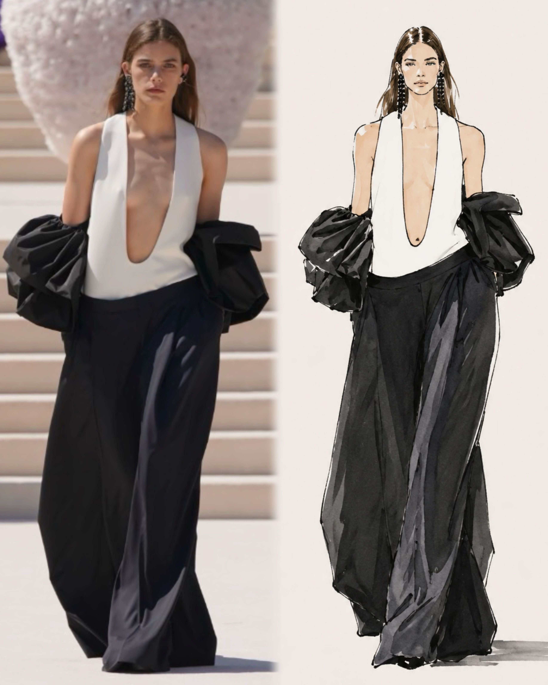
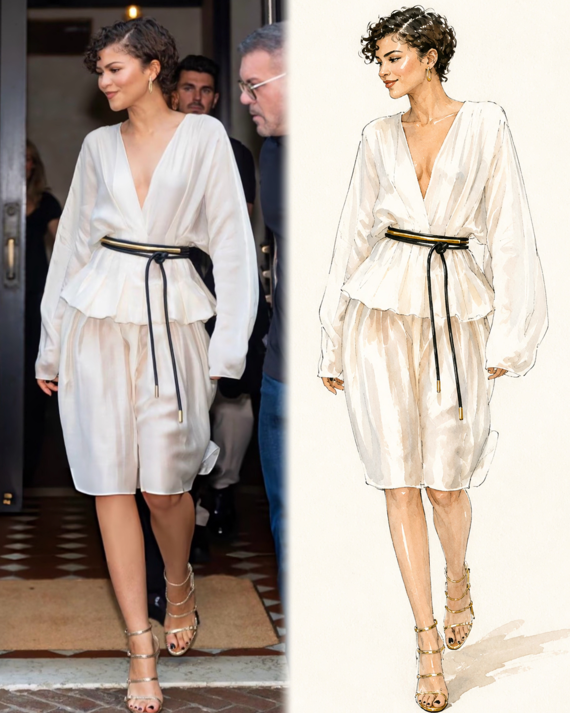
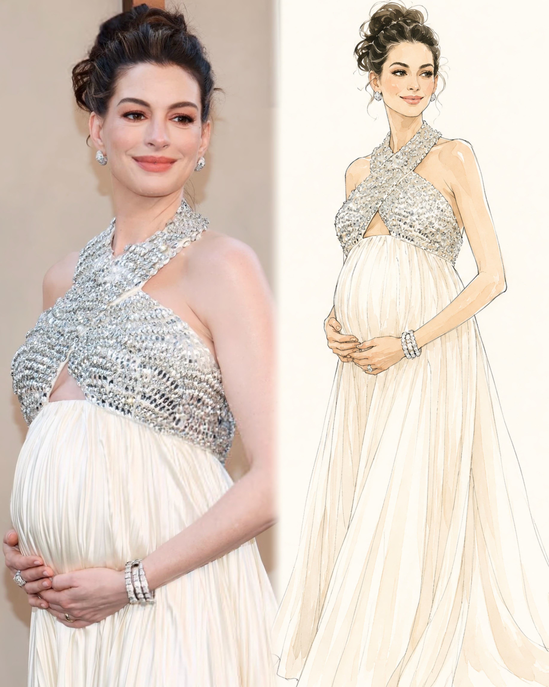

# Outfit to Fashion Illustration Skill

A reusable image-generation skill that converts real outfit photos into minimalist
fashion-editorial illustrations. It is not a generic cartoon filter and not a
realistic watercolor portrait — its signature result is a clean, hand-drawn
fashion sketch that faithfully preserves the outfit while simplifying the person
and the environment.

## Examples

Left: original photo · Right: generated illustration







## Default Look

- Elegant black ink or graphite lines
- Sparse watercolor or gouache color accents
- Accurate garment reconstruction (silhouette, construction, pattern, accessories)
- Simplified facial features and minimal skin rendering
- Warm ivory paper background
- Large areas of negative space
- Minimal or omitted background
- Paris fashion-magazine sketch mood

## How to Use

Upload an outfit photo and ask for the skill. Example prompts:

- "Use the outfit-to-fashion-illustration skill on this photo."
- "Turn this outfit into a minimalist fashion illustration."
- "Keep the person and outfit unchanged, remove the background, make it a fashion sketch."
- "Keep both people and render them as a fashion-magazine illustration."

By default the skill outputs a 3:4 portrait, full-body figure, minimal background.
See [`examples/quick-prompts.md`](examples/quick-prompts.md) for more ready-to-use prompts.

## How to Install

This is a Claude skill. To make it available in Claude Code, place the skill folder
in your skills directory:

```bash
git clone https://github.com/xiaozhoustefanie227/outfit-to-fashion-illustration-skill.git
mkdir -p ~/.claude/skills
cp -R outfit-to-fashion-illustration-skill ~/.claude/skills/outfit-to-fashion-illustration
```

Claude will pick up the skill from `SKILL.md`. You can then trigger it by uploading a
photo and asking to convert the outfit into a fashion illustration.

## Modes

- **Single Look** — one full-body figure, minimal background (default, strongest mode)
- **Seated Lifestyle Look** — keep only the chair, table, or prop the pose needs
- **Multiple Looks** — two or more figures arranged like an editorial lineup
- **Detail Study** — focus on one garment, bag, shoe, sleeve, or fabric detail
- **Non-Human Editorial** — same ink-and-watercolor language for animals or objects

## Package Contents

- `SKILL.md` — complete workflow and style rules
- `examples/quick-prompts.md` — ready-to-use prompt examples
- `assets/` — before/after example images
- `LICENSE` — MIT

## License

Released under the [MIT License](LICENSE).
